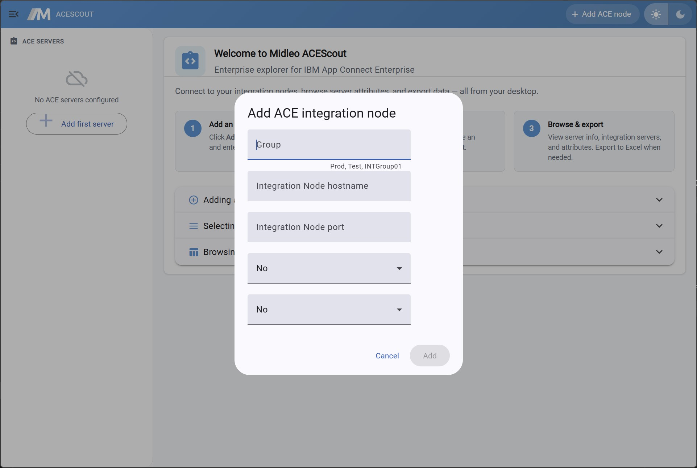

# Midleo ACEScout

Enterprise desktop explorer for IBM® App Connect Enterprise integration nodes. Built with Electron 43, Angular 22, and Angular Material.

> ACEScout is not affiliated with, endorsed by, or sponsored by IBM.



## Overview

Midleo ACEScout provides a desktop UI for browsing and working with IBM App Connect Enterprise integration nodes.

This repository contains the open-source Electron/Angular desktop application only. The application expects separate Java runtime components to be present on the user’s machine. Those Java components are not included in this repository and are not bundled in ACEScout installers.

## Prerequisites

### For running ACEScout

* Java 21+ runtime on `PATH`
* ACEScout runtime files in `~/.midleo/`
* Access to an IBM App Connect Enterprise environment
* IBM App Connect Enterprise client/API software obtained under your organization’s applicable IBM license terms

### For development

* Node.js 22+
* Java 21+ runtime on `PATH`
* ACEScout runtime files in `~/.midleo/`

## Required runtime files

ACEScout requires external Java runtime artifacts that are not part of this open-source repository.

Place the files under `~/.midleo/`:

```text
~/.midleo/
  acelist.json
  midleoace.jar
  midleolibs/
    libs/                 # gson, json-*, and runtime libraries required by midleoace.jar
    vendor/
      IntegrationAPI_ACE.jar
```

### `midleoace.jar`

`midleoace.jar` is a separate Midleo runtime component.

It is not open-source, is not licensed under GPL-3.0, and is not included in this repository or in ACEScout installers.

Obtain it separately from Midleo under the applicable Midleo license terms. Contact [vasilev.link](https://vasilev.link) for licensed distribution.

### IBM App Connect Enterprise Integration API JAR

`IntegrationAPI_ACE.jar` is IBM App Connect Enterprise client/API software.

It is not included in this repository or in ACEScout installers.

Users must obtain IBM App Connect Enterprise client/API software from their own licensed IBM App Connect Enterprise installation or licensed IBM software distribution, subject to the applicable IBM license terms.

Do not commit, bundle, package, or redistribute IBM App Connect Enterprise client/API files with ACEScout unless you have confirmed that your IBM license terms permit that distribution and you include all required IBM notices.

### Other Java libraries

Any additional Java libraries placed under `~/.midleo/midleolibs/libs/` remain subject to their own license terms.

Before distributing any build that includes Java libraries, verify license compatibility and include all required third-party notices.

The `resources/` folder in this repository shows the expected layout as documentation only. Files there are not bundled into the app.

## Repository layout

```text
.
├── resources/              # runtime layout documentation only
├── src/                    # Angular renderer source
├── electron/               # Electron main/preload source
├── release-builds/         # generated installers
├── package.json
└── LICENSE
```

## Getting started

1. Install Node.js 22+.

2. Install Java 21+ and verify it is available:

```bash
java -version
```

3. Create the runtime directories:

```bash
mkdir -p ~/.midleo/midleolibs/libs
mkdir -p ~/.midleo/midleolibs/vendor
```

4. Place the required runtime files in `~/.midleo/`:

```text
~/.midleo/acelist.json
~/.midleo/midleoace.jar
~/.midleo/midleolibs/vendor/IntegrationAPI_ACE.jar
```

5. Install dependencies and start the app:

```bash
npm install
npm run build:dev:all
npm start
```

## Development

Build and start ACEScout:

```bash
npm run build:dev:all
npm start
```

For watch mode:

```bash
npm run build:watch:all
```

## Production release

The production installer contains only the Electron/Angular ACEScout desktop application.

It does not include:

* `midleoace.jar`
* `IntegrationAPI_ACE.jar`
* IBM App Connect Enterprise runtime files
* proprietary Java artifacts
* third-party Java runtime artifacts from `~/.midleo/`

Build installers with:

```bash
npm run release        # package for current OS
npm run release:mac    # macOS DMG + zip
npm run release:win    # Windows NSIS installer
npm run release:linux  # AppImage + deb
```

Installers are written to:

```text
release-builds/
```

If you distribute ACEScout binaries or installers, provide the corresponding source code for the exact distributed version, including any modifications, as required by GPL-3.0.

## Security

* Renderer runs with context isolation and sandbox enabled.
* IPC is exposed only through an allowlisted `midleoApi` preload bridge.
* ACE commands are executed with `execFile` and do not use shell interpolation.
* Passwords and SSL secrets are encrypted at rest with Electron `safeStorage` when available.
* ACEScout does not download or install IBM App Connect Enterprise client/API software automatically.
* ACEScout does not bundle proprietary Java runtime files.

## NPM scripts

| Command                   | Description                                       |
| ------------------------- | ------------------------------------------------- |
| `npm run build:dev:all`   | Build renderer, main, and preload for development |
| `npm run build:prod:all`  | Build renderer, main, and preload for production  |
| `npm run build:watch:all` | Watch mode for all build targets                  |
| `npm run lint`            | Run Angular linting                               |
| `npm run test`            | Run unit tests in headless Chrome                 |
| `npm run release`         | Production build and electron-builder package     |

## License

This repository is licensed under GPL-3.0. See [LICENSE](LICENSE).

The GPL-3.0 license applies to the source code and binaries built from this repository. It does not grant rights to IBM App Connect Enterprise, `IntegrationAPI_ACE.jar`, `midleoace.jar`, or any other separately supplied proprietary or third-party runtime components.

If you distribute modified versions of ACEScout, you are responsible for complying with GPL-3.0 and with all applicable third-party dependency licenses.

## Third-party and proprietary components

ACEScout may interact with separately installed runtime components, including IBM App Connect Enterprise client/API software and Midleo runtime artifacts.

Those components are not licensed by this repository and are not covered by the GPL-3.0 license granted here.

Before redistributing any build, package, archive, installer, or runtime bundle that contains third-party or proprietary components, verify that you have the right to redistribute those components and include all required license notices.

## Trademark notice

IBM and IBM App Connect Enterprise are trademarks or registered trademarks of International Business Machines Corporation in the United States, other countries, or both.

Other product and service names may be trademarks of their respective owners.

## Troubleshooting

### White screen or `app.whenReady` crash

If `require('electron')` fails or the window stays white, check whether `ELECTRON_RUN_AS_NODE=1` is set in your environment. Some IDE terminals set this variable.

The `npm start` script clears it via `cross-env-shell` on all platforms.

Run:

```bash
npm start
```

On macOS/Linux without `cross-env`, you can also use:

```bash
env -u ELECTRON_RUN_AS_NODE npm start
```

### Missing `midleoace.jar`

Verify that this file exists:

```text
~/.midleo/midleoace.jar
```

If it is missing, obtain it separately from Midleo under the applicable license terms. Contact [vasilev.link](https://vasilev.link) for licensed distribution.

### Missing IBM App Connect Enterprise Integration API JAR

Verify that this file exists:

```text
~/.midleo/midleolibs/vendor/IntegrationAPI_ACE.jar
```

This file must be supplied by the user from an IBM-authorized source and used according to the applicable IBM license terms.

### Java / ACE connection errors

Check:

```bash
java -version
```

Ensure Java 21+ is installed and available on `PATH`.

Then verify that the runtime layout matches:

```text
~/.midleo/
  acelist.json
  midleoace.jar
  midleolibs/
    libs/
    vendor/
      IntegrationAPI_ACE.jar
```

Verify that the integration node REST API is reachable on the configured host and port.

### npm `allowScripts` warnings

Dependency install scripts are gated by the `allowScripts` field in `package.json`.

After pulling changes, run:

```bash
npm install
```

No additional approval steps should be required unless dependencies changed.
